# 8-bit ALU using Combinational Gates Only

## Overview
This project implements a fully functional 8-bit Arithmetic Logic Unit (ALU) using combinational logic gates in Verilog HDL. The ALU is designed for the **DE2-115 FPGA board** and includes an LCD display interface for real-time operation visualization.

## Features
- **8 Operations**: Addition, Subtraction, Multiplication, Division, AND, OR, XOR, NAND
- **Pure Combinational Logic**: No sequential elements in core arithmetic operations
- **Signed Arithmetic**: Supports signed 8-bit integers using two's complement
- **LCD Display**: Real-time display of operation and results on 16x2 LCD
- **DE2-115 Compatible**: Optimized for Altera DE2-115 FPGA development board

## Architecture

### Module Hierarchy
```
alu (Top Module)
├── alu_8bit (8-bit ALU Core)
│   ├── add_sub_8bit (Adder/Subtractor)
│   │   └── full_adder (1-bit Full Adder)
│   ├── logic_unit (Logic Operations)
│   ├── multiplier (8-bit Multiplier)
│   └── divider (8-bit Divider)
├── bin_to_ascii (Binary to ASCII Converter)
└── lcd_controller (LCD Display Driver)
```

### Supported Operations
| Opcode | Operation | Description |
|--------|-----------|-------------|
| 3'b000 | ADD | A + B |
| 3'b001 | SUB | A - B |
| 3'b010 | MUL | A × B |
| 3'b011 | DIV | A ÷ B |
| 3'b100 | AND | A & B |
| 3'b101 | OR | A \| B |
| 3'b110 | XOR | A ^ B |
| 3'b111 | NAND | ~(A & B) |

## Hardware Requirements
- **FPGA Board**: Altera DE2-115
- **LCD**: 16x2 Character LCD (Compatible with HD44780)
- **Inputs**: 
  - SW[7:0] → Input A
  - SW[15:8] → Input B
  - KEY[2:0] → Operation Select (Active Low)
- **Clock**: 50 MHz (CLOCK_50)

## Pin Configuration
### Inputs
- `CLOCK_50`: 50 MHz system clock
- `SW[15:0]`: 16 switches for operand inputs
- `KEY[2:0]`: 3 push buttons for operation selection

### Outputs
- `LCD_DATA[7:0]`: 8-bit data bus to LCD
- `LCD_RS`: Register Select (Command/Data)
- `LCD_RW`: Read/Write control
- `LCD_EN`: Enable signal
- `LCD_ON`: LCD power control
- `LCD_BLON`: LCD backlight control

## Implementation Details

### 1. Full Adder
- Pure combinational design using XOR and AND gates
- Forms the building block for 8-bit adder/subtractor

### 2. Adder/Subtractor
- Ripple carry adder with configurable subtraction mode
- Uses XOR gates to conditionally invert operand B for subtraction
- Implements two's complement arithmetic

### 3. Multiplier
- Shift-and-add algorithm
- Produces 16-bit result from two 8-bit signed operands
- Combinational implementation using generate loops

### 4. Divider
- Iterative subtraction method
- Handles signed division with proper sign management
- Returns quotient in 16-bit result format
- Division by zero returns 0

### 5. Logic Unit
- Implements bitwise operations: AND, OR, XOR, NAND
- Uses case statement for operation selection

### 6. LCD Controller
- State machine-based controller
- Automatically initializes LCD on startup
- Displays operation name and result
- Updates display continuously based on inputs

## Usage

### Simulation
1. Create a testbench file for simulation
2. Instantiate the `alu` module
3. Apply test vectors to `SW` and `KEY` inputs
4. Monitor the `result` output from `alu_8bit` module

### FPGA Implementation
1. **Create Project**: Open Quartus II and create a new project
2. **Add Source**: Add `alu.v` to your project
3. **Pin Assignment**: Assign pins according to DE2-115 pin mapping
4. **Compile**: Compile the design
5. **Program**: Download to FPGA using USB Blaster
6. **Test**: Use switches to input operands and keys to select operations

### Example Operation
```verilog
// Example: 5 + 3
SW[7:0] = 8'd5;    // Input A = 5
SW[15:8] = 8'd3;   // Input B = 3
KEY[2:0] = 3'b111; // Active low, so 000 → ADD operation
// Result displayed on LCD: "ADD: 008"
```

## File Structure
```
.
├── alu.v              # Complete ALU implementation
└── README.md          # This file
```

## Technical Specifications
- **Data Width**: 8-bit inputs, 16-bit output
- **Number Format**: Two's complement signed integers
- **Input Range**: -128 to +127
- **Output Range**: -32768 to +32767 (for multiplication)
- **Clock Frequency**: 50 MHz
- **LCD Update Rate**: Continuous refresh

## Design Principles
- **Modularity**: Each functional block is a separate module
- **Reusability**: Full adder is reused in ripple carry adder
- **Parameterization**: Generate statements for scalable designs
- **Combinational Focus**: Core ALU operations are purely combinational

## Limitations
- Division is relatively slow due to iterative algorithm
- No overflow/underflow flags
- LCD displays only lower 8 bits of result
- Limited to 8-bit operands

## Future Enhancements
- [ ] Add status flags (Zero, Carry, Overflow, Sign)
- [ ] Implement faster multiplication using Booth's algorithm
- [ ] Add shift and rotate operations
- [ ] Extend to 16-bit or 32-bit operations
- [ ] Add pipeline stages for higher clock frequencies
- [ ] Implement full 16-bit result display on LCD

## Testing
To verify the design:
1. Test each operation with positive and negative numbers
2. Check edge cases: -128, 0, +127
3. Verify division by zero handling
4. Test LCD display refresh
5. Validate timing constraints in Quartus TimeQuest

## Author
**CR Arya**  
M.S. Ramaiah University of Applied Sciences (RUAS)

## License
This project is open-source and available for educational purposes.

## References
- DE2-115 User Manual
- Verilog HDL specifications
- HD44780 LCD Controller Datasheet
- Digital Design and Computer Architecture by Harris & Harris


## FPGA Implementation

### Block Diagram
The following shows the functional block diagram of the ALU:

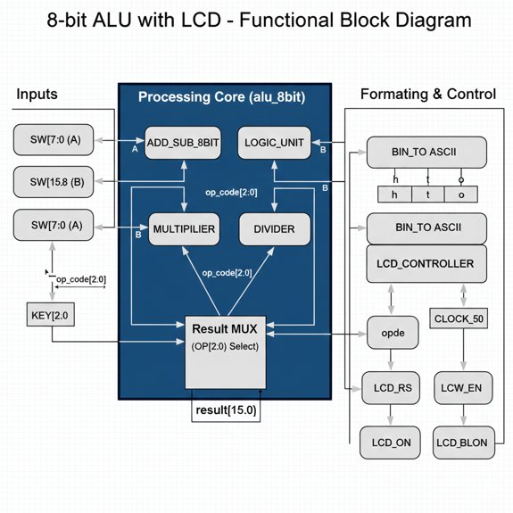
*Functional block diagram showing ALU components and data flow*

### RTL Schematic
RTL schematic generated by Quartus Prime:

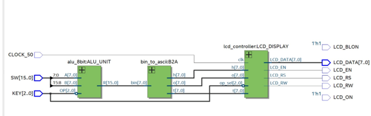
*RTL view of the 8-bit ALU design*


## Project Demonstration

Below are photos demonstrating all 8 operations of the ALU running on the DE2-115 board with real-time LCD display:

### Addition Operation
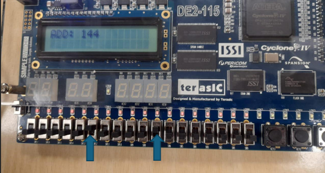
*Addition operation: Displaying result on LCD*

### Subtraction Operation
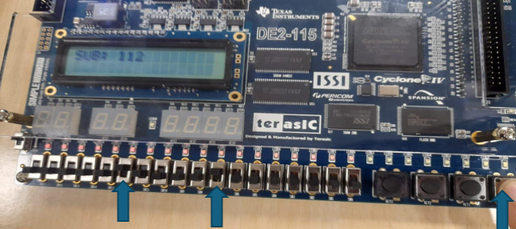
*Subtraction operation: A - B with LCD output*

### Multiplication Operation
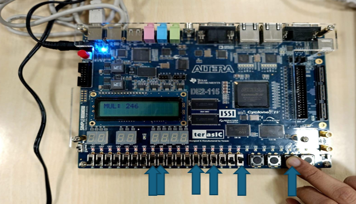
*Multiplication operation: A × B displayed on LCD*

### Division Operation
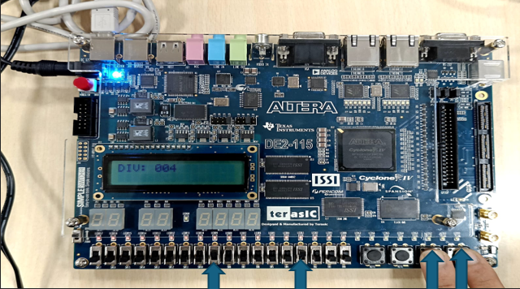
*Division operation: A ÷ B with quotient display*

### AND Operation
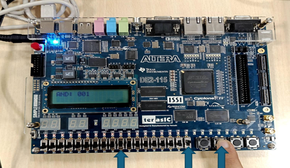
*Bitwise AND operation with result visualization*

### OR Operation
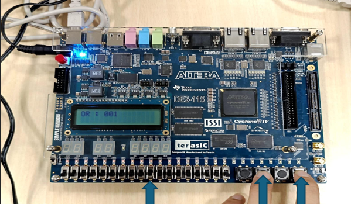
*Bitwise OR operation displayed on LCD*

### XOR Operation
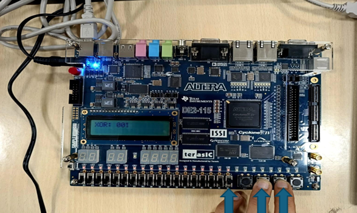
*Bitwise XOR operation with real-time output*

### NAND Operation
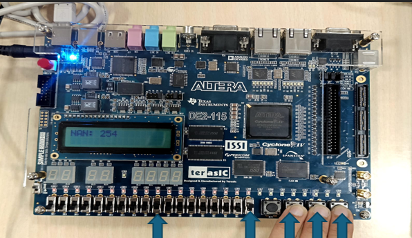
*NAND operation: Negated AND result on LCD*

## Simulation Results

### Timing Waveforms
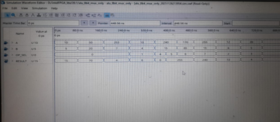
*Simulation results showing correct operation for all ALU functions*

## How to Upload Your Images

**To add your actual project images:**
1. Navigate to the `images/` folder in this repository
2. Click "Add file" → "Upload files"
3. Upload your images with these exact names:
   - `block_diagram.png` - Functional block diagram
   - `rtl_schematic.png` - RTL schematic from Quartus
   - `fpga_board.jpg` - Photo of DE2-115 board setup
   - `addition.jpg` - Addition operation demo
   - `subtraction.jpg` - Subtraction operation demo
   - `multiplication.jpg` - Multiplication operation demo
   - `division.jpg` - Division operation demo
   - `and.jpg` - AND operation demo
   - `or.jpg` - OR operation demo
   - `xor.jpg` - XOR operation demo
   - `nand.jpg` - NAND operation demo
   - `simulation.png` - Simulation waveforms
4. Commit the changes

---

**Note**: This implementation prioritizes educational clarity over performance optimization. For production designs, consider using dedicated FPGA DSP blocks and optimized IP cores.
